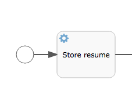

# activiti-starter
activiti-starter


https://spring.io/blog/2015/03/08/getting-started-with-activiti-and-spring-boot

spring 官网提供的教程 demo 
[Quickstart](https://github.com/jbarrez/spring-boot-with-activiti-example)

从5.22.0 升级到6.0.0 sql 会进行升级切换
```$xslt
2019-03-24 16:37:42.445  INFO 7892 --- [ost-startStop-1] o.s.web.context.ContextLoader            : Root WebApplicationContext: initialization completed in 1506 ms
2019-03-24 16:37:42.590  INFO 7892 --- [ost-startStop-1] o.s.b.w.servlet.ServletRegistrationBean  : Mapping servlet: 'dispatcherServlet' to [/]
2019-03-24 16:37:42.594  INFO 7892 --- [ost-startStop-1] o.s.b.w.servlet.FilterRegistrationBean   : Mapping filter: 'characterEncodingFilter' to: [/*]
2019-03-24 16:37:42.595  INFO 7892 --- [ost-startStop-1] o.s.b.w.servlet.FilterRegistrationBean   : Mapping filter: 'hiddenHttpMethodFilter' to: [/*]
2019-03-24 16:37:42.595  INFO 7892 --- [ost-startStop-1] o.s.b.w.servlet.FilterRegistrationBean   : Mapping filter: 'httpPutFormContentFilter' to: [/*]
2019-03-24 16:37:42.595  INFO 7892 --- [ost-startStop-1] o.s.b.w.servlet.FilterRegistrationBean   : Mapping filter: 'requestContextFilter' to: [/*]
2019-03-24 16:37:43.957  INFO 7892 --- [           main] aultActiviti5CompatibilityHandlerFactory : Activiti 5 compatibility handler implementation not found or error during instantiation : org.activiti.compatibility.DefaultActiviti5CompatibilityHandler. Activiti 5 backwards compatibility disabled.
2019-03-24 16:37:44.089  INFO 7892 --- [           main] o.activiti.engine.impl.db.DbSqlSession   : upgrading activiti engine schema from 5.22.0.0 to 6.0.0.4
2019-03-24 16:37:44.090  INFO 7892 --- [           main] o.activiti.engine.impl.db.DbSqlSession   : Upgrade needed: 52200 -> 59900. Looking for schema update resource for component 'engine'
2019-03-24 16:37:44.091  INFO 7892 --- [           main] o.activiti.engine.impl.db.DbSqlSession   : no schema resource org/activiti/db/upgrade/activiti.mysql.upgradestep.52200.to.59900.engine.sql for upgrade
2019-03-24 16:37:44.091  INFO 7892 --- [           main] o.activiti.engine.impl.db.DbSqlSession   : Upgrade needed: 59900 -> 6000. Looking for schema update resource for component 'engine'
2019-03-24 16:37:44.091  INFO 7892 --- [           main] o.activiti.engine.impl.db.DbSqlSession   : performing upgrade on engine with resource org/activiti/db/upgrade/activiti.mysql.upgradestep.59900.to.6000.engine.sql
2019-03-24 16:37:44.091  INFO 7892 --- [           main] o.activiti.engine.impl.db.DbSqlSession   : Found MySQL: majorVersion=5 minorVersion=6
2019-03-24 16:37:49.526  INFO 7892 --- [           main] o.activiti.engine.impl.db.DbSqlSession   : Upgrade needed: 6000 -> 6001. Looking for schema update resource for component 'engine'
2019-03-24 16:37:49.527  INFO 7892 --- [           main] o.activiti.engine.impl.db.DbSqlSession   : performing upgrade on engine with resource org/activiti/db/upgrade/activiti.mysql.upgradestep.6000.to.6001.engine.sql
2019-03-24 16:37:49.527  INFO 7892 --- [           main] o.activiti.engine.impl.db.DbSqlSession   : Found MySQL: majorVersion=5 minorVersion=6
2019-03-24 16:37:50.638  INFO 7892 --- [           main] o.activiti.engine.impl.db.DbSqlSession   : Upgrade needed: 6001 -> 6002. Looking for schema update resource for component 'engine'
2019-03-24 16:37:50.638  INFO 7892 --- [           main] o.activiti.engine.impl.db.DbSqlSession   : performing upgrade on engine with resource org/activiti/db/upgrade/activiti.mysql.upgradestep.6001.to.6002.engine.sql
2019-03-24 16:37:50.638  INFO 7892 --- [           main] o.activiti.engine.impl.db.DbSqlSession   : Found MySQL: majorVersion=5 minorVersion=6
2019-03-24 16:38:23.984  INFO 7892 --- [           main] o.activiti.engine.impl.db.DbSqlSession   : Upgrade needed: 6002 -> 6003. Looking for schema update resource for component 'engine'
2019-03-24 16:38:23.985  INFO 7892 --- [           main] o.activiti.engine.impl.db.DbSqlSession   : performing upgrade on engine with resource org/activiti/db/upgrade/activiti.mysql.upgradestep.6002.to.6003.engine.sql
2019-03-24 16:38:23.985  INFO 7892 --- [           main] o.activiti.engine.impl.db.DbSqlSession   : Found MySQL: majorVersion=5 minorVersion=6
2019-03-24 16:38:24.035  INFO 7892 --- [           main] o.activiti.engine.impl.db.DbSqlSession   : Upgrade needed: 6003 -> 6004. Looking for schema update resource for component 'engine'
2019-03-24 16:38:24.035  INFO 7892 --- [           main] o.activiti.engine.impl.db.DbSqlSession   : performing upgrade on engine with resource org/activiti/db/upgrade/activiti.mysql.upgradestep.6003.to.6004.engine.sql
2019-03-24 16:38:24.035  INFO 7892 --- [           main] o.activiti.engine.impl.db.DbSqlSession   : Found MySQL: majorVersion=5 minorVersion=6
2019-03-24 16:38:24.086  INFO 7892 --- [           main] o.activiti.engine.impl.db.DbSqlSession   : upgrading activiti history schema from 5.22.0.0 to 6.0.0.4
2019-03-24 16:38:24.086  INFO 7892 --- [           main] o.activiti.engine.impl.db.DbSqlSession   : Upgrade needed: 52200 -> 59900. Looking for schema update resource for component 'history'
2019-03-24 16:38:24.086  INFO 7892 --- [           main] o.activiti.engine.impl.db.DbSqlSession   : no schema resource org/activiti/db/upgrade/activiti.mysql.upgradestep.52200.to.59900.history.sql for upgrade
2019-03-24 16:38:24.086  INFO 7892 --- [           main] o.activiti.engine.impl.db.DbSqlSession   : Upgrade needed: 59900 -> 6000. Looking for schema update resource for component 'history'
2019-03-24 16:38:24.086  INFO 7892 --- [           main] o.activiti.engine.impl.db.DbSqlSession   : no schema resource org/activiti/db/upgrade/activiti.mysql.upgradestep.59900.to.6000.history.sql for upgrade
2019-03-24 16:38:24.086  INFO 7892 --- [           main] o.activiti.engine.impl.db.DbSqlSession   : Upgrade needed: 6000 -> 6001. Looking for schema update resource for component 'history'
2019-03-24 16:38:24.087  INFO 7892 --- [           main] o.activiti.engine.impl.db.DbSqlSession   : no schema resource org/activiti/db/upgrade/activiti.mysql.upgradestep.6000.to.6001.history.sql for upgrade
2019-03-24 16:38:24.087  INFO 7892 --- [           main] o.activiti.engine.impl.db.DbSqlSession   : Upgrade needed: 6001 -> 6002. Looking for schema update resource for component 'history'
2019-03-24 16:38:24.087  INFO 7892 --- [           main] o.activiti.engine.impl.db.DbSqlSession   : performing upgrade on history with resource org/activiti/db/upgrade/activiti.mysql.upgradestep.6001.to.6002.history.sql
2019-03-24 16:38:24.087  INFO 7892 --- [           main] o.activiti.engine.impl.db.DbSqlSession   : Found MySQL: majorVersion=5 minorVersion=6
2019-03-24 16:38:25.121  INFO 7892 --- [           main] o.activiti.engine.impl.db.DbSqlSession   : Upgrade needed: 6002 -> 6003. Looking for schema update resource for component 'history'
2019-03-24 16:38:25.121  INFO 7892 --- [           main] o.activiti.engine.impl.db.DbSqlSession   : no schema resource org/activiti/db/upgrade/activiti.mysql.upgradestep.6002.to.6003.history.sql for upgrade
2019-03-24 16:38:25.121  INFO 7892 --- [           main] o.activiti.engine.impl.db.DbSqlSession   : Upgrade needed: 6003 -> 6004. Looking for schema update resource for component 'history'
2019-03-24 16:38:25.121  INFO 7892 --- [           main] o.activiti.engine.impl.db.DbSqlSession   : no schema resource org/activiti/db/upgrade/activiti.mysql.upgradestep.6003.to.6004.history.sql for upgrade
2019-03-24 16:38:25.122  INFO 7892 --- [           main] o.activiti.engine.impl.db.DbSqlSession   : upgrading activiti identity schema from 5.22.0.0 to 6.0.0.4
2019-03-24 16:38:25.122  INFO 7892 --- [           main] o.activiti.engine.impl.db.DbSqlSession   : Upgrade needed: 52200 -> 59900. Looking for schema update resource for component 'identity'
2019-03-24 16:38:25.123  INFO 7892 --- [           main] o.activiti.engine.impl.db.DbSqlSession   : no schema resource org/activiti/db/upgrade/activiti.mysql.upgradestep.52200.to.59900.identity.sql for upgrade
2019-03-24 16:38:25.123  INFO 7892 --- [           main] o.activiti.engine.impl.db.DbSqlSession   : Upgrade needed: 59900 -> 6000. Looking for schema update resource for component 'identity'
2019-03-24 16:38:25.123  INFO 7892 --- [           main] o.activiti.engine.impl.db.DbSqlSession   : no schema resource org/activiti/db/upgrade/activiti.mysql.upgradestep.59900.to.6000.identity.sql for upgrade
2019-03-24 16:38:25.123  INFO 7892 --- [           main] o.activiti.engine.impl.db.DbSqlSession   : Upgrade needed: 6000 -> 6001. Looking for schema update resource for component 'identity'
2019-03-24 16:38:25.123  INFO 7892 --- [           main] o.activiti.engine.impl.db.DbSqlSession   : no schema resource org/activiti/db/upgrade/activiti.mysql.upgradestep.6000.to.6001.identity.sql for upgrade
2019-03-24 16:38:25.123  INFO 7892 --- [           main] o.activiti.engine.impl.db.DbSqlSession   : Upgrade needed: 6001 -> 6002. Looking for schema update resource for component 'identity'
2019-03-24 16:38:25.123  INFO 7892 --- [           main] o.activiti.engine.impl.db.DbSqlSession   : no schema resource org/activiti/db/upgrade/activiti.mysql.upgradestep.6001.to.6002.identity.sql for upgrade
2019-03-24 16:38:25.123  INFO 7892 --- [           main] o.activiti.engine.impl.db.DbSqlSession   : Upgrade needed: 6002 -> 6003. Looking for schema update resource for component 'identity'
2019-03-24 16:38:25.124  INFO 7892 --- [           main] o.activiti.engine.impl.db.DbSqlSession   : no schema resource org/activiti/db/upgrade/activiti.mysql.upgradestep.6002.to.6003.identity.sql for upgrade
2019-03-24 16:38:25.125  INFO 7892 --- [           main] o.activiti.engine.impl.db.DbSqlSession   : Upgrade needed: 6003 -> 6004. Looking for schema update resource for component 'identity'
2019-03-24 16:38:25.125  INFO 7892 --- [           main] o.activiti.engine.impl.db.DbSqlSession   : no schema resource org/activiti/db/upgrade/activiti.mysql.upgradestep.6003.to.6004.identity.sql for upgrade
2019-03-24 16:38:25.246  INFO 7892 --- [           main] o.a.engine.impl.ProcessEngineImpl        : ProcessEngine default created
2019-03-24 16:38:25.247  INFO 7892 --- [           main] o.a.e.i.a.DefaultAsyncJobExecutor        : Starting up the default async job executor [org.activiti.spring.SpringAsyncExecutor].
2019-03-24 16:38:25.248  INFO 7892 --- [      Thread-92] o.a.e.i.a.AcquireAsyncJobsDueRunnable    : {} starting to acquire async jobs due
2019-03-24 16:38:25.248  INFO 7892 --- [      Thread-94] o.a.e.i.a.ResetExpiredJobsRunnable       : {} starting to reset expired jobs
2019-03-24 16:38:25.248  INFO 7892 --- [      Thread-93] o.a.e.i.a.AcquireTimerJobsRunnable       : {} starting to acquire async jobs due
2019-03-24 16:38:25.649  INFO 7892 --- [           main] s.w.s.m.m.a.RequestMappingHandlerAdapter : Looking for @ControllerAdvice: org.springframework.boot.context.embedded.AnnotationConfigEmbeddedWebApplicationContext@53045c6c: startup date [Sun Mar 24 16:37:40 CST 2019]; root of context hierarchy
2019-03-24 16:38:25.703  INFO 7892 --- [           main] s.w.s.m.m.a.RequestMappingHandlerMapping : Mapped "{[/error]}" onto public org.springframework.http.ResponseEntity<java.util.Map<java.lang.String, java.lang.Object>> org.springframework.boot.autoconfigure.web.BasicErrorController.error(javax.servlet.http.HttpServletRequest)
2019-03-24 16:38:25.704  INFO 7892 --- [           main] s.w.s.m.m.a.RequestMappingHandlerMapping : Mapped "{[/error],produces=[text/html]}" onto public org.springframework.web.servlet.ModelAndView org.springframework.boot.autoconfigure.web.BasicErrorController.errorHtml(javax.servlet.http.HttpServletRequest,javax.servlet.http.HttpServletResponse)
2019-03-24 16:38:25.737  INFO 7892 --- [           main] o.s.w.s.handler.SimpleUrlHandlerMapping  : Mapped URL path [/webjars/**] onto handler of type [class org.springframework.web.servlet.resource.ResourceHttpRequestHandler]
2019-03-24 16:38:25.737  INFO 7892 --- [           main] o.s.w.s.handler.SimpleUrlHandlerMapping  : Mapped URL path [/**] onto handler of type [class org.springframework.web.servlet.resource.ResourceHttpRequestHandler]
2019-03-24 16:38:25.776  INFO 7892 --- [           main] o.s.w.s.handler.SimpleUrlHandlerMapping  : Mapped URL path [/**/favicon.ico] onto handler of type [class org.springframework.web.servlet.resource.ResourceHttpRequestHandler]
2019-03-24 16:38:26.123  INFO 7892 --- [           main] o.s.j.e.a.AnnotationMBeanExporter        : Registering beans for JMX exposure on startup
2019-03-24 16:38:26.176  INFO 7892 --- [           main] s.b.c.e.t.TomcatEmbeddedServletContainer : Tomcat started on port(s): 8081 (http)
2019-03-24 16:38:26.180  INFO 7892 --- [           main] org.activiti.examples.DemoApplication    : Started DemoApplication in 45.688 seconds (JVM running for 46.665)
```
另外摘抄了分享牛的特性说明：[原文](http://www.shareniu.com/article/30.htm)


本文重点分析Activiti6新增的一些特性，从而可以更好的了解Activiti6的走向。

Activiti6最大的变化点就是对代码进行了重构，该版本修复以往的Bug并不多，但内部实现相对来说变化比较大。其突出的变化如下所示：

新增两款新引擎，Form引擎和DMN引擎（动态引擎）。  
其中DMN引擎允许开发人员创建自己的决策表。可以通过变量和定义的规则方式从决策表中计算结果。这些决策表的数据可以被rule task调用，决策表与流程实例是完全隔离的，相互之间不需要知道对方的存在。Form引擎可以通过Activiti6 UI界面进行配置，通俗一点的理解就是Activiti6将Form表单独立出来了。Form表单信息可以以JSON格式进行定义和使用。Activiti6 UI 默认包括新的规则引擎和表单引擎。
新增ad-hoc子流程。可以参考文章（ad-hoc子流程使用）。
 作业执行器被重构。
 
 Activiti6版本仅保留了Activiti5版本中的异步作业执行器（async executor）。
 定时作业被划分了四个不同的表：executable jobs, timer jobs, suspended jobs 和deadletter jobs。
 引擎可以更快的执行作业。定时器作业在新的版本存储于单独的表中，一个线程会定时轮训需要执行的作业，快到期的作业会被添加到suspended jobs表中。
 重试的作业已经被干掉了，需要重试的作业会被添加到deadletter jobs表中。这样的重构意义主要是为了提高查询效率，可以执行的作业可以很快的被查询出来。
作业执行器通过消息队列的方式进行，关于这一点可以参考随后的文章。
瞬态变量的引入。瞬态变量不会存储到 Activiti 变量表中，但仍为单一的事务持续时间执行。比如可以在REST服务之间进行调用的时候使用，或者使用于Java service task。
引入了事务依赖监听器，可以参考Activiti依赖事务监听器（上）的讲解。
 Activiti 6 UI 程序中，添加了DMN编辑器。
 对于多实例节点而言，添加了终止多实例节点的相关方法。这个特性允许开发人员使用API结束多实例所有节点的执行。
优化补偿活动行为和在子流程中的使用。
 在运行流程实例以及执行实例中添加了开始时间以及启动流程实例的人字段。在ru_task中增加了任务的认领时间（claim time）。
妥善解决数据库架构 (oracle/postgres) 的使用。
修复历史数据捕获。
大量重构 Activiti 6 UI 应用程序，例如应用程序中定义现在部署作为正常的活动部署，没有为其单独的应用程序定义表。
改进Activiti 6 QA中的问题。

# Quickstart
## Preface
This document will describe how to get started with activiti and spring-boot. It is a port of the blog post [http://spring.io/blog/2015/03/08/getting-started-with-activiti-and-spring-boot](http://spring.io/blog/2015/03/08/getting-started-with-activiti-and-spring-boot). Minor tweaks to code and formatting have been done. Without further ado, the readme.

## Introduction
Activiti is an Apache-licensed business process management (BPM) engine. Such an engine has as core goal to take a process definition comprised of human tasks and service calls and execute those in a certain order, while exposing various API's to start, manage and query data about process instances for that definition. Contrary to many of its competitors, Activiti is lightweight and integrates easily with any Java technology or project. All that, and it works at any scale - from just a few dozen to many thousands or even millions of process executions.


The source code of Activiti can be found on [Github](https://github.com/Activiti/Activiti). The project was founded and is sponsored by [Alfresco](http://www.alfresco.com/), but enjoys contributions from all across the globe and industries.

A process definition is typically visualized as a flow-chart-like diagram. In recent years, the BPMN 2.0 standard (an OMG standard, like UML) has become the de-facto 憀anguage?of these diagrams. This standard defines how a certain shape on the diagram should be interpreted, both technically and business-wise and how it is stored, as a not-so-hipster XML file.. but luckily most of the tooling hides this for you. This is a standard, and you can use any number of compliant tools to design (and even run) your BPMN processes. That said, if you抮e asking me, there is no better choice than Activiti!

## Spring Boot integration
Activiti and Spring play nicely together. The convention-over-configuration approach in Spring Boot works nicely with Activiti's process engine is setup and use. Out of the box, you only need a database, as process executions can span anywhere from a few seconds to a couple of years. Obviously, as an intrinsic part of a process definition is calling and consuming data to and from various systems with all kinds of technologies. The simplicity of adding the needed dependencies and integrating various pieces of (boiler-plate) logic with Spring Boot really makes this child's play.

Using Spring Boot and Activiti in a microservice approach also makes a lot of sense. Spring Boot makes it easy to get a production-ready service up and running in no time and - in a distributed microservice architecture - Activiti processes can glue together various microservices while also weaving in human workflow (tasks and forms) to achieve a certain goal.

The Spring Boot integration in Activiti was created by Spring expert [Josh Long](https://twitter.com/starbuxman). Josh and I [did a webinar a couple of months ago](https://www.youtube.com/watch?v=0PV_8Lew3vg) that should give you a good insight into the basics of the Activiti integration for Spring Boot. The [Activiti user guide section on Spring Boot](http://activiti.org/userguide/index.html#springSpringBoot) is also a great starting place to get more information.

## Getting Started

The code for this example can be [found in my Github repository](https://github.com/jbarrez/spring-boot-with-activiti-example).

The process we抣l implement here is a hiring process for a developer. It's simplified of course (as it needs to fit on this web page), but you should get the core concepts. Here's the diagram:


As said in the introduction, all shapes here have a very specific interpretation thanks to the BPMN 2.0 standard. But even without knowledge of BPMN, the process is pretty easy to understand:

* When the process starts, the resume of the job applicant is stored in an external system.
* The process then waits until a telephone interview has been conducted. This is done by a user (see the little icon of a person in the corner).
* If the telephone interview wasn抰 all that, a polite rejection email is sent. Otherwise, both a tech interview and financial negotiation should happen.
* Note that at any point, the applicant can cancel. That's shown in the diagram as the event on the boundary of the big rectangle. When the event happens, everything inside will be killed and the process halts.
* If all goes well, a welcome email is sent.

This is the [BPMN for this process](https://github.com/jbarrez/spring-boot-with-activiti-example/blob/master/src/main/resources/processes/Developer_Hiring.bpmn20.xml)

Let's create a new Maven project, and add the dependencies needed to get Spring Boot, Activiti and a database. We抣l use an in memory database to keep things simple.

```maven
<dependency>
    <groupId>org.activiti</groupId>
    <artifactId>spring-boot-starter-basic</artifactId>
    <version>${activiti.version}</version>
</dependency>
<dependency>
    <groupId>com.h2database</groupId>
    <artifactId>h2</artifactId>
    <version>1.4.185</version>
</dependency>
```

So only two dependencies is what is needed to create a very first Spring Boot + Activiti application:

```java
@SpringBootApplication
public class MyApp {

    public static void main(String[] args) {
        SpringApplication.run(MyApp.class, args);
    } 
}
```

You could already run this application, it won抰 do anything functionally but behind the scenes it already

* creates an in-memory H2 database
* creates an Activiti process engine using that database
* exposes all Activiti services as Spring Beans
* configures tidbits here and there such as the Activiti async job executor, mail server, etc.

Let's get something running. Drop the BPMN 2.0 process definition into the `src/main/resources/processes` folder. All processes placed here will automatically be deployed (ie. parsed and made to be executable) to the Activiti engine. Let's keep things simple to start, and create a `CommanLineRunner` that will be executed when the app boots up:

```java
@Bean
CommandLineRunner init( final RepositoryService repositoryService,
                              final RuntimeService runtimeService,
                              final TaskService taskService) {

    return new CommandLineRunner() {

        public void run(String... strings) throws Exception {
            Map<String, Object> variables = new HashMap<String, Object>();
            variables.put("applicantName", "John Doe");
            variables.put("email", "john.doe@activiti.com");
            variables.put("phoneNumber", "123456789");
            runtimeService.startProcessInstanceByKey("hireProcess", variables);
        }
    };
}
```

So what's happening here is that we create a map of all the variables needed to run the process and pass it when starting process. If you抎 check the process definition you抣l see we reference those variables using ${variableName} in many places (such as the task description).

The first step of the process is an automatic step (see the little cogwheel icon), implemented using an expression that uses a Spring Bean:



which is implemented with

```
activiti:expression="${resumeService.storeResume()}"
```

Of course, we need that bean or the process would not start. So let's create it:

```java
@Component
public class ResumeService {

    public void storeResume() {
        System.out.println("Storing resume ...");
    }

}
```

When running the application now, you抣l see that the bean is called:

```
  .   ____          _            __ _ _
 /\\ / ___'_ __ _ _(_)_ __  __ _ \ \ \ \
( ( )\___ | '_ | '_| | '_ \/ _` | \ \ \ \
 \\/  ___)| |_)| | | | | || (_| |  ) ) ) )
  '  |____| .__|_| |_|_| |_\__, | / / / /
 =========|_|==============|___/=/_/_/_/
 :: Spring Boot ::        (v1.2.0.RELEASE)

2015-02-16 11:55:11.129  INFO 304 --- [           main] MyApp                                    : Starting MyApp on The-Activiti-Machine.local with PID 304 ...
Storing resume ...
2015-02-16 11:55:13.662  INFO 304 --- [           main] MyApp                                    : Started MyApp in 2.788 seconds (JVM running for 3.067)
```

And that's it! Congrats with running your first process instance using Activiti in Spring Boot!

Let's spice things up a bit, and add following dependency to our pom.xml:

```maven
<dependency>
    <groupId>org.activiti</groupId>
    <artifactId>spring-boot-starter-rest-api</artifactId>
    <version>${activiti.version}}</version>
</dependency>
```

Having this on the classpath does a nifty thing: it takes the Activiti REST API (which is written in Spring MVC) and exposes this fully in your application. The REST API of Activiti [is fully documented in the Activiti User Guide](http://activiti.org/userguide/index.html#_rest_api).

The REST API is secured by basic auth, and won抰 have any users by default. Let's add an admin user to the system as shown below (add this to the MyApp class). Don抰 do this in a production system of course, there you抣l want to hook in the authentication to LDAP or something else.

```java
@Bean
InitializingBean usersAndGroupsInitializer(final IdentityService identityService) {

    return new InitializingBean() {
        public void afterPropertiesSet() throws Exception {

            Group group = identityService.newGroup("user");
            group.setName("users");
            group.setType("security-role");
            identityService.saveGroup(group);

            User admin = identityService.newUser("admin");
            admin.setPassword("admin");
            identityService.saveUser(admin);

        }
    };
}
```

Start the application. We can now start a process instance as we did in the `CommandLineRunner`, but now using REST:

```
curl -u admin:admin -H "Content-Type: application/json" -d '{"processDefinitionKey":"hireProcess", "variables": [ {"name":"applicantName", "value":"John Doe"}, {"name":"email", "value":"john.doe@alfresco.com"}, {"name":"phoneNumber", "value":"1234567"} ]}' http://localhost:8080/runtime/process-instances
Which returns us the json representation of the process instance:
```

```
{
     "tenantId": "",
     "url": "http://localhost:8080/runtime/process-instances/5",
     "activityId": "sid-42BAE58A-8FFB-4B02-AAED-E0D8EA5A7E39",
     "id": "5",
     "processDefinitionUrl": "http://localhost:8080/repository/process-definitions/hireProcess:1:4",
     "suspended": false,
     "completed": false,
     "ended": false,
     "businessKey": null,
     "variables": [],
     "processDefinitionId": "hireProcess:1:4"
}
```

I just want to stand still for a moment how cool this is. Just by adding one dependency, you抮e getting the whole Activiti REST API embedded in your application!

Let's make it even cooler, and add following dependency

```maven
<dependency>
    <groupId>org.activiti</groupId>
    <artifactId>spring-boot-starter-actuator</artifactId>
    <version>${activiti.version}</version>
</dependency>
```

This adds a Spring Boot actuator endpoint for Activiti. If we restart the application, and hit http://localhost:8080/activiti/, we get some basic stats about our processes. With some imagination that in a live system you抳e got many more process definitions deployed and executing, you can see how this is useful.

The same actuator is also registered as a JMX bean exposing similar information.

```
{
    completedTaskCountToday: 0,
    deployedProcessDefinitions: [
       "hireProcess (v1)"
    ],
    processDefinitionCount: 1,
   cachedProcessDefinitionCount: 1,
   runningProcessInstanceCount: {
       hireProcess (v1): 0
    },
    completedTaskCount: 0,
    completedActivities: 0,
    completedProcessInstanceCount: {
        hireProcess (v1): 0
    },
    openTaskCount: 0
}
```

To finish our coding, let's create a dedicated REST endpoint for our hire process, that could be consumed by for example a javascript web application (out of scope for this article). So most likely, we抣l have a form for the applicant to fill in the details we抳e been passing programmatically above. And while we抮e at it, let's store the applicant information as a JPA entity. In that case, the data won抰 be stored in Activiti anymore, but in a separate table and referenced by Activiti when needed.

You probably guessed it by now, JPA support is enabled by adding a dependency:

```maven
<dependency>
    <groupId>org.activiti</groupId>
    <artifactId>spring-boot-starter-jpa</artifactId>
    <version>${activiti.version}</version>
</dependency>
```

and add the entity to the MyApp class:

```java
@Entity
class Applicant {

    @Id
    @GeneratedValue
    private Long id;

    private String name;

    private String email;

    private String phoneNumber;

    // Getters and setters
```

We抣l also need a Repository for this Entity (put this in a separate file or also in MyApp). No need for any methods, the Repository magic from Spring will generate the methods we need for us.

```java
public interface ApplicantRepository extends JpaRepository<Applicant, Long> {
  // .. 
}
```

And now we can create the dedicated REST endpoint:

```java
@RestController
public class MyRestController {

    @Autowired
    private RuntimeService runtimeService;

    @Autowired
    private ApplicantRepository applicantRepository;

    @RequestMapping(value="/start-hire-process", method= RequestMethod.POST, produces= MediaType.APPLICATION_JSON_VALUE)
    public void startHireProcess(@RequestBody Map<String, String> data) {

        Applicant applicant = new Applicant(data.get("name"), data.get("email"), data.get("phoneNumber"));
        applicantRepository.save(applicant);

        Map<String, Object> variables = new HashMap<String, Object>();
        variables.put("applicant", applicant);
        runtimeService.startProcessInstanceByKey("hireProcessWithJpa", variables);
    } 
}
```

Note we抮e now using a slightly different process called `hireProcessWithJpa`, which has a few tweaks in it to cope with the fact the data is now in a JPA entity. So for example, we can抰 use `${applicantName}` anymore, but we now have to use `${applicant.name}`.

Let's restart the application and start a new process instance:

```
curl -u admin:admin -H "Content-Type: application/json" -d '{"name":"John Doe", "email": "john.doe@alfresco.com", "phoneNumber":"123456789"}' http://localhost:8080/start-hire-process
```

We can now go through our process. You could create a custom endpoints for this too, exposing different task queries with different forms ?but I抣l leave this to your imagination and use the default Activiti REST end points to walk through the process.

Let's see which task the process instance currently is at (you could pass in more detailed parameters here, for example the `processInstanceId` for better filtering):

```
curl -u admin:admin -H "Content-Type: application/json" http://localhost:8080/runtime/tasks
```

which returns

```
{
     "order": "asc",
     "size": 1,
     "sort": "id",
     "total": 1,
     "data": [{
          "id": "14",
          "processInstanceId": "8",
          "createTime": "2015-02-16T13:11:26.078+01:00",
          "description": "Conduct a telephone interview with John Doe. Phone number = 123456789",
          "name": "Telephone interview"
          ...
     }],
     "start": 0
}
```

So, our process is now at the Telephone interview. In a realistic application, there would be a task list and a form that could be filled in to complete this task. Let's complete this task (we have to set the `telephoneInterviewOutcome` variable as the exclusive gateway uses it to route the execution):

```
curl -u admin:admin -H "Content-Type: application/json" -d '{"action" : "complete", "variables": [ {"name":"telephoneInterviewOutcome", "value":true} ]}' http://localhost:8080/runtime/tasks/14
```

When we get the tasks again now, the process instance will have moved on to the two tasks in parallel in the subprocess (big rectangle):

```
{
     "order": "asc",
     "size": 2,
     "sort": "id",
     "total": 2,
     "data": [
          {
              ...
               "name": "Tech interview"
          },
          {
              ...
               "name": "Financial negotiation"
          }
     ],
     "start": 0
}
```

We can now continue the rest of the process in a similar fashion, but I抣l leave that to you to play around with.

## Testing

One of the strengths of using Activiti for creating business processes is that everything is simply Java. As a consequence, processes can be tested as regular Java code with unit tests. Spring Boot makes writing such test a breeze.

Here's how the unit test for the 揾appy path?looks like (while omitting `@Autowired` fields and test e-mail server setup). The code also shows the use of the Activiti API's for querying tasks for a given group and process instance.

```java
@RunWith(SpringJUnit4ClassRunner.class)
@SpringApplicationConfiguration(classes = {MyApp.class})
@WebAppConfiguration
@IntegrationTest
public class HireProcessTest {

    @Test
    public void testHappyPath() {

        // Create test applicant
        Applicant applicant = new Applicant("John Doe", "john@activiti.org", "12344");
        applicantRepository.save(applicant);

        // Start process instance
        Map<String, Object> variables = new HashMap<String, Object>();
        variables.put("applicant", applicant);
        ProcessInstance processInstance = runtimeService.startProcessInstanceByKey("hireProcessWithJpa", variables);

        // First, the 'phone interview' should be active
        Task task = taskService.createTaskQuery()
                .processInstanceId(processInstance.getId())
                .taskCandidateGroup("dev-managers")
                .singleResult();
        Assert.assertEquals("Telephone interview", task.getName());

        // Completing the phone interview with success should trigger two new tasks
        Map<String, Object> taskVariables = new HashMap<String, Object>();
        taskVariables.put("telephoneInterviewOutcome", true);
        taskService.complete(task.getId(), taskVariables);

        List<Task> tasks = taskService.createTaskQuery()
                .processInstanceId(processInstance.getId())
                .orderByTaskName().asc()
                .list();
        Assert.assertEquals(2, tasks.size());
        Assert.assertEquals("Financial negotiation", tasks.get(0).getName());
        Assert.assertEquals("Tech interview", tasks.get(1).getName());

        // Completing both should wrap up the subprocess, send out the 'welcome mail' and end the process instance
        taskVariables = new HashMap<String, Object>();
        taskVariables.put("techOk", true);
        taskService.complete(tasks.get(0).getId(), taskVariables);

        taskVariables = new HashMap<String, Object>();
        taskVariables.put("financialOk", true);
        taskService.complete(tasks.get(1).getId(), taskVariables);

        // Verify email
        Assert.assertEquals(1, wiser.getMessages().size());

        // Verify process completed
        Assert.assertEquals(1, historyService.createHistoricProcessInstanceQuery().finished().count());

    }
}
```

## Next steps

* We haven抰 touched any of the tooling around Activiti. There is a bunch more than just the engine, like the Eclipse plugin to design processes, a free web editor in the cloud (also included in the `.zip` download you can get from [Activiti's site](http://activiti.org/), a web application that showcases many of the features of the engine, ?* The current release of Activiti (version 5.17.0) has integration with Spring Boot 1.1.6. However, the current master version is compatible with 1.2.1.
* Using Spring Boot 1.2.0 brings us sweet stuff like support for XA transactions with JTA. This means you can hook up your processes easily with JMS, JPA and Activiti logic all in the same transaction! ..Which brings us to the next point ?* In this example, we抳e focussed heavily on human interactions (and barely touched it). But there's many things you can do around orchestrating systems too. The Spring Boot integration also has Spring Integration support you could leverage to do just that in a very neat way!
* And of course there is much much more about the BPMN 2.0 standard. Read more about it [in the Activiti docs](http://activiti.org/userguide/index.html#bpmnConstructs).

## Addenda
These addenda are not a part of the original article.

### Spring Boot Maven plugin
The [Spring Boot Maven plugin](http://docs.spring.io/spring-boot/docs/current/maven-plugin/index.html) can be used directly with this example application. It can make it easier to run the Spring Boot app with a simple `mvn spring-boot:run`. Here is the POM file configuration needed:

```maven
<build>
  ...
  <plugins>
    ...
    <plugin>
      <groupId>org.springframework.boot</groupId>
      <artifactId>spring-boot-maven-plugin</artifactId>
      <version>1.2.2.RELEASE</version>
      <executions>
        <execution>
          <goals>
            <goal>repackage</goal>
          </goals>
        </execution>
      </executions>
    </plugin>
    ...
  </plugins>
  ...
</build>
```

See [the usage page](http://docs.spring.io/spring-boot/docs/current/maven-plugin/usage.html) for full documentation.

### Gradle
Given that this is a Spring Boot application, everything done here in Maven can be easily done (often more easily than in Maven) using [Gradle](http://gradle.org/). See [the Gradle plugin documentation](http://docs.spring.io/spring-boot/docs/current/reference/html/build-tool-plugins-gradle-plugin.html) for Spring Boot for more details.

### Article author's blog

[Joram Barrez's blog](http://www.jorambarrez.be/blog/)